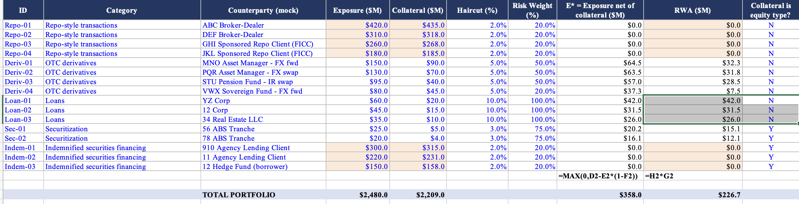

# RWA and CET1 Model: State Street Markets (Mock)

## Purpose

This is a small project I built to understand how a bank turns a portfolio of trades into a capital ratio. I created a fictional trading and financing book shaped like State Street Markets' real business, then worked through how much regulatory capital it would need to hold: first on a normal day, then in a severe recession, and finally under a new set of capital rules regulators are proposing (Basel III Endgame).

## What's fictional versus real

Fictional: the repo, derivatives, loans, securitizations, and indemnified securities financing positions.

Real: the formulas, the scenario assumptions, and the rule logic. These come from State Street's public filings (10Q, stress test disclosure) and the actual Basel III Endgame proposals. I also set the CET1 capital figure so the baseline ratio lands close to State Street's real reported ratio of 10.8%, as a sanity check that the model behaves the way a real bank's numbers would.

## What's inside

| File | What it covers |
|---|---|
| Python model | Runs all three scenarios end to end and prints the results |
| Baseline tab | RWA and CET1 ratio under normal conditions, plus a check against the real reported number |
| Stress tab | The same book under a severe recession (unemployment at 10 percent, GDP falling 7.8 percent, equities down 50 percent) |
| Basel III Endgame tab | The two new capital charges Endgame adds, compared across current rules and both Endgame versions |

## What I found interesting

Two things stood out while building this.

**1. Zero dollar RWA**

At baseline, four repo transactions and three indemnified securities financing transactions, some of the largest dollar amounts in the whole book, carry exactly zero dollars in RWA. This isn't because they're low risk on paper. It's because they're collateralized slightly above 100 percent, so once collateral is subtracted from exposure, there's nothing left to charge capital against. Meanwhile, three unsecured loans, much smaller in size, end up driving nearly half of total RWA. This is the clearest illustration in the model of how capital requirements actually work: they track how well a position is collateralized, not how large it is. That treatment only holds up while markets are calm. Once the same book is run through a stress scenario, the equity shock reduces that collateral cushion, and the RWA comes back.

**2. Why State Street pushed back on the original Endgame proposal**

At first I assumed Endgame would just adjust existing risk weights. That turned out to be wrong. It actually adds two brand new charges that don't exist under current Basel III. The first is Operational Risk RWA, calculated off called the Business Indicator, which is built mostly from fee income rather than lending activity. That matters a for a custody bank like State Street, which makes most of its money from fees rather than interest. The 2023 draft measured that fee income on a gross basis, meaning income plus expenses with no netting, which hits a bank that depends on fee income especially hard. State Street raised this concern directly in its own filings. The second is a CVA charge on derivatives, a capital add on for counterparty mark to market risk. In this model, CVA alone adds roughly $20 million in RWA at baseline and about $26 million under stress, so it is not a small piece of the total increase.

The 2026 re proposal doesn't remove the charge. It's still there, and Endgame is still, on net, a bigger capital burden than today's rules. But it does soften this one piece, allowing fee income to be measured net instead of gross. That single change moved my model's stressed ratio from 4.7 percent, uncomfortably close to the 4.5 percent floor, up to 5.1 percent. Nothing about the underlying business changed. Only the accounting treatment of one input did. That's what made this proposal feel less like regulators backing off, and more like regulators responding to one specific.

## The headline finding

Both Endgame versions leave this mock bank worse off than current Basel III rules, which is expected, since Endgame adds two new charges rather than removing anything: Operational Risk RWA and a CVA charge on derivatives. What's more interesting is how much worse, and why.

Under the 2023 draft, the stressed ratio falls to 4.7 percent, just 0.2 points above the regulatory floor. Under the 2026 re proposal, the same stress scenario lands at 5.1 percent, a noticeably larger buffer. The CVA charge is identical in both versions, so it is not what moves the number. The entire swing between 4.7 and 5.1 comes from one accounting choice inside the Operational Risk charge: whether fee income is measured gross or net of expenses. Worth noting separately, the baseline ratio also shifts between the two versions, 8.0 percent under the 2023 draft versus 9.1 percent under 2026, for the same reason, since the Operational Risk charge applies whether or not the bank is under stress.

That is the detail an institution like State Street will care about most, more than the broader shape of Basel III Endgame.

## The math behind it

Everything runs off two formulas, the standard Basel approach for collateralized exposures.

**E\* = MAX(0, Exposure − Collateral × (1 − Haircut))**

This is the actual exposure at risk: whatever remains after subtracting the collateral you hold, discounted by the haircut, since collateral can lose value before you're able to sell it.

**RWA = E\* × Risk Weight**

The risk weight is a regulator set multiplier for how risky that counterparty or collateral type is considered.

Under stress, three things shift before those formulas run again: equity linked collateral is cut by the equity shock (50 percent decline), haircuts widen by 5 points, and risk weights climb by 10 points.

For the Basel III Endgame side, the new Operational Risk charge is:

**Operational Risk RWA = 12.5 × Business Indicator × Marginal Coefficient × Internal Loss Multiplier**

The Business Indicator is interest income plus services income plus financial income. The difference between the 2023 draft and the 2026 re proposal is whether the services leg nets out fee expenses or not.

The second Endgame charge is simpler. CVA RWA is modeled here as a flat 20 percent of Derivatives RWA, applied at both baseline and under stress. It does not depend on the fee income treatment, so it is identical across the 2023 draft and the 2026 re proposal. Total Endgame RWA in this model is current Basel III RWA plus Operational Risk RWA plus CVA RWA.

## Sources

| Source | Used for |
|---|---|
| State Street 10Q, June 30, 2026 | Transaction categories, RWA roll forward table, and the indemnified securities financing figures in Note 9 |
| State Street 2025 Dodd Frank Act Stress Test Disclosure, July 1, 2025 | Severely Adverse scenario assumptions (unemployment, GDP, equity decline) |
| State Street 2Q26 Earnings Release Addendum | Real CET1 ratio and RWA, used to calibrate the baseline |
| Federal Reserve press release, March 19, 2026 | Announcement of the Basel III Endgame re proposal, used for direction and magnitude only, not exact figures |

